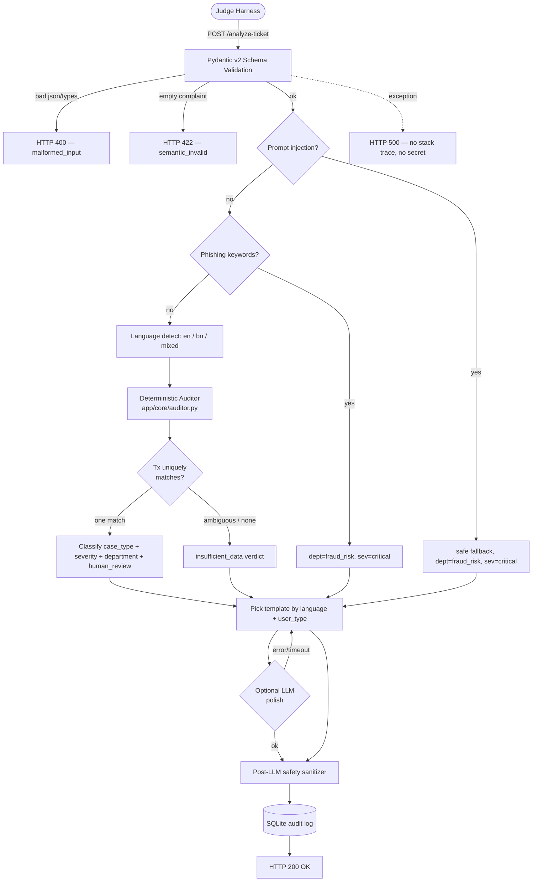

# Product Requirements Document (PRD)

## PrantoLedger — AI-Powered Internal SupportOps Copilot API

**Project name:** `prantoledger`
**Stack:** Python 3.11 + FastAPI + SQLite (local) + Groq LLM (multi-key pool, graceful per-key degradation)
**Build budget:** 1.5 hours / 90 minutes (single-VM, CPU-only, no GPU)
**Target deploy:** Poridhi Lab / small VM (2 vCPU, 4 GB RAM), `0.0.0.0:8000`, Docker image < 500 MB

---

## 0. Quick Orientation

This PRD defines the **service only**. No frontend, no dashboard, no real payment integration. The service is a **read-only internal copilot** that ingests one complaint + a short transaction snippet and returns one structured JSON verdict.

The PRD is written so that an engineer with 1.5 hours can read it once and build directly. It is structured in priority order, mirroring the rubric weights:

1. §4 Evidence reasoning (35 pts) — deterministic rule engine
2. §5 Safety & escalation (20 pts) — pre/post-LLM guardrails
3. §6 API contract & schema (15 pts) — exact enum + field shapes
4. §7 Performance & reliability (10 pts) — fast, stable, no crashes
5. §8 Response quality (10 pts, manual) — concise, safe, useful prose
6. §9 Deployment & reproducibility (5 pts) — Docker + runbook
7. §10 Documentation (5 pts, manual) — README + `.env.example` + sample output

---

## 1. Executive Summary & Context

During peak campaign events on digital finance platforms (national cashback, merchant promotions, mobile recharge booms), support queues swell to tens of thousands of complaints per evening, far exceeding human review capacity.

**PrantoLedger** is a CPU-only FastAPI service that acts as an internal copilot for support agents. For each ticket it:

1. **Investigates** — compares the complaint text against the supplied transaction snippet using deterministic rules (no guessing).
2. **Audits** — emits `relevant_transaction_id`, `evidence_verdict` ∈ {`consistent`, `inconsistent`, `insufficient_data`}.
3. **Routes** — assigns one of six `department` values and one of eight `case_type` values.
4. **Prioritises** — assigns `severity` ∈ {`low`, `medium`, `high`, `critical`} and `human_review_required: bool`.
5. **Protects** — drafts a `customer_reply` that never asks for credentials and never confirms a refund it has no authority to confirm.

The system is positioned as an **internal copilot**, never an autonomous financial decision maker. When evidence is unclear, it must say so, not guess.

---

## 2. Scope (1.5-Hour Build Plan)

### 2.1 In Scope (must ship)
- `GET /health` returning `{"status":"ok"}` within 60 s of process start.
- `POST /analyze-ticket` returning a schema-compliant JSON response within 30 s (p95 ≤ 5 s).
- Deterministic rule-based auditor covering all 8 `case_type` values.
- Hardcoded multilingual templates (English + Bangla) for `customer_reply`.
- Pre-LLM prompt-injection filter and post-LLM safety sanitizer.
- SQLite audit log (one row per request) — used as the "medium-secure local DB".
- Dockerfile (CPU, < 500 MB target), `.env.example`, `requirements.txt`, `README.md`, sample output JSON.
- 10/10 public sample cases verified before submission.

### 2.2 Out of Scope (do not build)
- Frontend / UI / dashboard.
- Authentication, login, rate-limiting middleware beyond a simple in-process counter.
- Real payment-system integration (synthetic data only).
- GPU inference, large local LLMs (>500 MB weights), model fine-tuning.
- Persistent multi-user state beyond the SQLite audit log.
- 90-second walkthrough video (recommended but not required; skipped to save the 1.5-hour budget).

### 2.3 Database Choice — SQLite (justified)
SQLite is the correct local-DB choice for this build because:

| Criterion | Why SQLite wins |
|---|---|
| Setup cost | Zero — single file, no server, no auth. |
| Footprint | < 2 MB native library, ships with Python. |
| Reliability | ACID, WAL mode survives crashes mid-evaluation. |
| Security posture | File-locked to one process; chmod 600 in Docker; "medium-secure" for an internal copilot. |
| Operations | One volume mount for backup; trivially inspectable via `sqlite3` CLI. |
| Rubric fit | Supports Deployment & Reproducibility (5 pts) — judges can inspect logs. |

SQLite is **not** used for live transaction data (the harness supplies the snippet in every request). It is used for:

1. **Audit log** — one row per `/analyze-ticket` call (ticket id, verdict, decision path, latency).
2. **Decision cache** — keyed by `hash(complaint + history)` to short-circuit repeat calls during stress testing.
3. **Safety log** — flag rows for prompt-injection / phishing attempts for security review.

---

## 3. System Architecture & Request Pipeline

The architecture is a **rule-first, LLM-optional** pipeline. All evidence reasoning happens in Python before any LLM call. The LLM (when enabled and reachable) is used only for prose drafting and is bypassed on any failure.



### 3.1 Stage Details

| # | Stage | Implementation | Failure mode |
|---|---|---|---|
| 1 | **Schema parse** | Pydantic v2 `AnalyzeTicketRequest` | 400 on bad JSON / wrong types; 422 on empty `complaint`. |
| 2 | **Injection filter** | Regex blocklist (`app/core/safety.py`) | If hit → safe fallback payload, dept=`fraud_risk`, sev=`critical`. |
| 3 | **Phishing detect** | Keyword scanner (English + Bangla) | If hit → `case_type=phishing_or_social_engineering`, dept=`fraud_risk`, sev=`critical`. |
| 4 | **Language detect** | Bangla Unicode regex → `bn`; Banglish heuristics → `mixed`; else `en` | Default `en` if unknown. |
| 5 | **Audit** | `app/core/auditor.py` rule engine | Always deterministic; never raises to caller. |
| 6 | **Classify** | Pure-Python mapper (no LLM) | Always returns valid enum. |
| 7 | **Template pick** | Dict lookup keyed by `(language, user_type, case_type)` | Falls back to `en/customer/other` template. |
| 8 | **LLM polish (optional)** | Groq `llama-3.3-70b-versatile` via **rotating key pool** (`GROQ_API_KEYS`) | **Bypassed on any error / all keys cooling** — template output used directly. See §10.5. |
| 9 | **Sanitize** | Regex post-filter on `customer_reply` + `recommended_next_action` | If violation → replace with safe fallback string. |
| 10 | **Log + respond** | SQLite insert, return JSON | Log failure swallowed; response still returned. |

---

## 4. Tech Stack & Repository Blueprint

```
prantoledger/
├── app/
│   ├── __init__.py
│   ├── main.py                  # FastAPI app, CORS, lifespan, /health, /analyze-ticket
│   ├── schemas.py               # Pydantic v2 Request/Response models (exact enums)
│   │
│   ├── core/
│   │   ├── __init__.py
│   │   ├── auditor.py           # Deterministic rule engine (Section 7)
│   │   ├── safety.py            # Prompt-injection + phishing detector + sanitizer
│   │   ├── language.py          # en / bn / mixed detector + Bangla digit map
│   │   ├── classifier.py        # case_type + severity + department + human_review
│   │   ├── templates.py         # Multilingual reply templates
│   │   └── llm.py               # Optional Groq wrapper, hard-timeout, never fatal
│   │
│   └── db/
│       ├── __init__.py
│       └── sqlite_store.py      # Audit log + decision cache (sqlite3 stdlib)
│
├── tests/
│   ├── test_auditor.py          # All 10 public samples
│   ├── test_safety.py           # Injection + phishing + PIN-OTP + refund
│   └── test_api.py              # FastAPI TestClient end-to-end
│
├── samples/
│   └── sample_output.json       # Verified response from SAMPLE-01
│
├── data/                        # Created at runtime, volume-mounted in Docker
│   └── auditor.db               # SQLite file (chmod 600 in entrypoint)
│
├── .env.example
├── Dockerfile
├── requirements.txt
└── README.md
```

### 4.1 Stack Components

| Component | Choice | Reason |
|---|---|---|
| Language | Python 3.11 | Stdlib `sqlite3`, fast iteration, no compile step. |
| Web framework | FastAPI 0.115 + Uvicorn | Async, auto-OpenAPI, Pydantic v2 native. |
| Validation | Pydantic v2 | Strict enums, `model_validator`, exact JSON shape. |
| Local DB | SQLite 3 (stdlib `sqlite3`) | Zero install, file-based, "medium-secure". |
| Translation | Local Bangla→English keyword map (no external API) | Avoids quota risk during judging. |
| LLM (primary, optional-on-error) | Groq `llama-3.3-70b-versatile` | Major public LLM provider (allowed per problem statement §9.1). Free tier, ~2 s latency on CPU-only infra, used for reply polish with safe template as fallback. |
| HTTP client | `httpx` | Async, used only for the optional LLM call. |
| Test runner | `pytest` + `httpx.TestClient` | Standard. |
| Process manager | Plain `uvicorn` (1 worker) | Single-process keeps SQLite write-safe. |

### 4.2 `requirements.txt` (pinned, lean)

```
fastapi==0.115.0
uvicorn[standard]==0.30.6
pydantic==2.9.2
httpx==0.27.2
python-dotenv==1.0.1
pytest==8.3.3
```

No `langdetect`, no `deep-translator`, no `openai`, no `groq` SDK pinned as required — Groq is called via raw `httpx` so the service still runs without the SDK if the key is absent.

---

## 5. API Endpoint Specifications

### 5.1 `GET /health`

- **Purpose**: Prove the service is alive before hidden tests begin.
- **Latency requirement**: First response within **60 s** of process start.
- **Response (200)**:
  ```json
  {"status": "ok"}
  ```
- **Headers**: `Content-Type: application/json; charset=utf-8`.

### 5.2 `POST /analyze-ticket`

- **Latency requirement**: Respond within **30 s** (p95 ≤ 5 s for full Performance credit).
- **Request**: JSON body per §6.1.
- **Response**: JSON body per §6.2.
- **Status codes**:

  | Code | When |
  |---|---|
  | 200 | Successful analysis (schema-valid input, response generated). |
  | 400 | Malformed JSON, wrong types, missing required fields. Body: `{"error": "malformed_input", "detail": "<short msg>"}`. |
  | 422 | Schema-valid but semantically invalid (e.g. `complaint` is empty string). Body: `{"error": "semantic_invalid", "detail": "complaint is empty"}`. |
  | 500 | Internal error. Body: `{"error": "internal_error", "detail": "non-sensitive msg"}`. **No stack trace, no secret.** |

The service **must never crash** on malformed input. A 400 / 422 / 500 is acceptable; a process exit is not.

---

## 6. Input & Output Schemas (Exact, Pydantic v2)

These match the problem statement byte-for-byte. Variants (case, plurals, alternate spellings) are scored as schema violations.

### 6.1 Request Schema

```python
from enum import Enum
from typing import List, Optional
from pydantic import BaseModel, Field, field_validator

class LanguageEnum(str, Enum):
    en = "en"
    bn = "bn"
    mixed = "mixed"

class ChannelEnum(str, Enum):
    in_app_chat = "in_app_chat"
    call_center = "call_center"
    email = "email"
    merchant_portal = "merchant_portal"
    field_agent = "field_agent"

class UserTypeEnum(str, Enum):
    customer = "customer"
    merchant = "merchant"
    agent = "agent"
    unknown = "unknown"

class TransactionTypeEnum(str, Enum):
    transfer = "transfer"
    payment = "payment"
    cash_in = "cash_in"
    cash_out = "cash_out"
    settlement = "settlement"
    refund = "refund"

class TransactionStatusEnum(str, Enum):
    completed = "completed"
    failed = "failed"
    pending = "pending"
    reversed = "reversed"

class TransactionHistoryEntry(BaseModel):
    transaction_id: str
    timestamp: str          # ISO 8601, may end with Z
    type: TransactionTypeEnum
    amount: float
    counterparty: str
    status: TransactionStatusEnum

class AnalyzeTicketRequest(BaseModel):
    ticket_id: str = Field(..., min_length=1)
    complaint: str = Field(..., min_length=1)
    language: Optional[LanguageEnum] = None
    channel: Optional[ChannelEnum] = None
    user_type: Optional[UserTypeEnum] = None
    campaign_context: Optional[str] = None
    transaction_history: Optional[List[TransactionHistoryEntry]] = Field(default_factory=list)
    metadata: Optional[dict] = Field(default_factory=dict)

    @field_validator("complaint")
    @classmethod
    def complaint_not_blank(cls, v: str) -> str:
        if not v.strip():
            raise ValueError("complaint must not be blank")
        return v
```

### 6.2 Response Schema (every required field present, exact enum spellings)

```python
class EvidenceVerdictEnum(str, Enum):
    consistent = "consistent"
    inconsistent = "inconsistent"
    insufficient_data = "insufficient_data"

class CaseTypeEnum(str, Enum):
    wrong_transfer = "wrong_transfer"
    payment_failed = "payment_failed"
    refund_request = "refund_request"
    duplicate_payment = "duplicate_payment"
    merchant_settlement_delay = "merchant_settlement_delay"
    agent_cash_in_issue = "agent_cash_in_issue"
    phishing_or_social_engineering = "phishing_or_social_engineering"
    other = "other"

class SeverityEnum(str, Enum):
    low = "low"
    medium = "medium"
    high = "high"
    critical = "critical"

class DepartmentEnum(str, Enum):
    customer_support = "customer_support"
    dispute_resolution = "dispute_resolution"
    payments_ops = "payments_ops"
    merchant_operations = "merchant_operations"
    agent_operations = "agent_operations"
    fraud_risk = "fraud_risk"

class AnalyzeTicketResponse(BaseModel):
    ticket_id: str
    relevant_transaction_id: Optional[str] = None      # null if no match
    evidence_verdict: EvidenceVerdictEnum
    case_type: CaseTypeEnum
    severity: SeverityEnum
    department: DepartmentEnum
    agent_summary: str = Field(..., min_length=10)
    recommended_next_action: str = Field(..., min_length=10)
    customer_reply: str = Field(..., min_length=10)
    human_review_required: bool
    confidence: float = Field(default=0.8, ge=0.0, le=1.0)
    reason_codes: List[str] = Field(default_factory=list)
```

Notes:
- `relevant_transaction_id` is `null` (JSON `null`) when no transaction in the supplied history matches the complaint — **never** an empty string.
- `confidence` is heuristic; values close to 1.0 only when the evidence is unambiguous.

---

## 7. Deterministic Auditor (Off-LLM Rule Engine) — the 35-Point Core

This is the highest-weighted section. The auditor runs **before** any LLM call and produces all categorical decisions.

### 7.1 Audit Decision Tree

```
START
  │
  ├─► transaction_history empty?
  │     └─► phishing_or_social_engineering detected? ─► evidence_verdict=insufficient_data
  │                                                          case_type=phishing_or_social_engineering
  │                                                          dept=fraud_risk, sev=critical, human_review=true
  │     └─► otherwise ─► evidence_verdict=insufficient_data
  │                       case_type=other
  │                       dept=customer_support, sev=low, human_review=false
  │
  ├─► phishing keywords in complaint? ─► (same as above) dept=fraud_risk, sev=critical
  │
  ├─► Extract amount from complaint (handles ০১২৩ digits and "taka/tk/টাকা" suffix)
  │
  ├─► Filter history to amount_matches = entries with |tx.amount − extracted| < 0.01
  │
  ├─► Duplicate-payment check (SAMPLE-10):
  │     two amount_matches with same type, counterparty, status=completed,
  │     and timestamp delta ≤ 60 s?
  │       └─► relevant_transaction_id = SECOND entry
  │            evidence_verdict = consistent
  │            case_type = duplicate_payment
  │            dept = payments_ops, sev = high, human_review = true
  │
  ├─► Wrong-transfer pattern check (SAMPLE-02):
  │     complaint mentions "wrong"/"ভুল" AND
  │     the amount_match counterparty has ≥ 2 prior completed transfers
  │     in the same history window?
  │       └─► relevant_transaction_id = latest matching transfer
  │            evidence_verdict = inconsistent
  │            case_type = wrong_transfer
  │            dept = dispute_resolution, sev = medium, human_review = true
  │
  ├─► Ambiguity check (SAMPLE-08):
  │     ≥ 2 amount_matches with different counterparties?
  │       └─► relevant_transaction_id = null
  │            evidence_verdict = insufficient_data
  │            case_type = wrong_transfer
  │            dept = dispute_resolution, sev = medium, human_review = false
  │
  ├─► Status-conflict check (SAMPLE-03):
  │     amount_match with status=failed AND complaint mentions "balance deducted"
  │       └─► relevant_transaction_id = failed entry
  │            evidence_verdict = consistent
  │            case_type = payment_failed
  │            dept = payments_ops, sev = high, human_review = false
  │
  ├─► Pending settlement check (SAMPLE-09):
  │     amount_match type=settlement, status=pending, user_type=merchant?
  │       └─► case_type = merchant_settlement_delay, dept = merchant_operations,
  │            sev = medium, human_review = false
  │
  ├─► Agent cash-in pending (SAMPLE-07):
  │     amount_match type=cash_in, status=pending, counterparty starts with "AGENT-"?
  │       └─► case_type = agent_cash_in_issue, dept = agent_operations,
  │            sev = high, human_review = true
  │
  ├─► Refund request check (SAMPLE-04):
  │     complaint mentions "refund"/"ফেরত"/"টাকা ফেরত" AND
  │     amount_match type=payment status=completed?
  │       └─► case_type = refund_request, dept = customer_support (low sev) OR
  │            dispute_resolution (≥ 1000 BDT)
  │            evidence_verdict = consistent
  │            human_review = false
  │
  ├─► Wrong transfer (SAMPLE-01):
  │     complaint mentions "wrong"/"ভুল" AND single amount_match type=transfer?
  │       └─► case_type = wrong_transfer, dept = dispute_resolution,
  │            sev = high (≥ 1000 BDT) else medium, human_review = true
  │
  └─► Default (single amount match, no special pattern):
        evidence_verdict = consistent
        case_type = other (or more specific if user_type hints)
        dept = customer_support, sev = low, human_review = false
```

### 7.2 Severity Heuristics

| Condition | Severity | Human review |
|---|---|---|
| `case_type = phishing_or_social_engineering` | `critical` | `true` |
| `case_type = duplicate_payment` | `high` | `true` |
| `case_type = payment_failed` (failed + balance deducted) | `high` | `false` |
| `case_type = agent_cash_in_issue` | `high` | `true` |
| `case_type = wrong_transfer` AND amount ≥ 1000 BDT | `high` | `true` |
| `case_type = wrong_transfer` AND amount < 1000 BDT | `medium` | `true` |
| `case_type = merchant_settlement_delay` | `medium` | `false` |
| `case_type = refund_request` AND amount ≥ 1000 BDT | `medium` | `true` |
| `case_type = refund_request` AND amount < 1000 BDT | `low` | `false` |
| `case_type = other`, vague complaint | `low` | `false` |
| `evidence_verdict = inconsistent` (not phishing) | `medium` | `true` |
| `evidence_verdict = insufficient_data` (not phishing) | `low` | `false` |

### 7.3 Confidence Score

```python
def confidence(audit: AuditResult) -> float:
    if audit.verdict == "consistent" and audit.match_kind in {"exact_amount_status_match", "duplicate_detected"}:
        return 0.95
    if audit.verdict == "consistent":
        return 0.85
    if audit.verdict == "inconsistent":
        return 0.75
    # insufficient_data
    if audit.phishing or audit.history_empty:
        return 0.95   # confident in the safety decision even if data is missing
    return 0.60
```

### 7.4 Reason Codes (deterministic, short labels)

| Code | Trigger |
|---|---|
| `tx_match` | single amount + counterparty + status match |
| `duplicate_detected` | two completed txs ≤ 60 s apart |
| `established_recipient_pattern` | ≥ 2 prior transfers to same counterparty |
| `ambiguous_match` | ≥ 2 amount_matches, different counterparties |
| `empty_transaction_history` | history list empty or missing |
| `status_contradicts_complaint` | failed payment + deducted-balance claim |
| `pending_settlement` | settlement tx status=pending |
| `pending_cash_in` | cash_in tx status=pending |
| `phishing_keywords_detected` | phishing regex hit |
| `prompt_injection_blocked` | injection regex hit |
| `vague_complaint` | no amount, no counterparty, no type keywords |

---

## 8. Multilingual & Bangla Support (Tie-Breaker Category)

### 8.1 Language Detection (no external API)

```python
import re
BANGLA_UNICODE = re.compile(r"[\u0980-\u09FF]")

def detect_language(text: str, hint: Optional[str]) -> str:
    if hint in {"en", "bn", "mixed"}:
        return hint
    if BANGLA_UNICODE.search(text):
        return "bn"
    # Banglish heuristic
    if re.search(r"\b(ami|amar|taka|tk|din|kal|aj|wrong number)\b", text, re.I):
        return "mixed"
    return "en"
```

### 8.2 Bangla Digit Normalisation

```python
_BN_DIGITS = str.maketrans("০১২৩৪৫৬৭৮৯", "0123456789")

def normalize_bangla_digits(text: str) -> str:
    return text.translate(_BN_DIGITS)
```

### 8.3 Time Keywords → Window Filter

| Bangla | English | Window |
|---|---|---|
| `আজ`, `today` | today | last 24 h from latest tx |
| `গতকাল`, `কাল`, `yesterday` | yesterday | 24–48 h before latest tx |
| `সকালে` | morning | 06:00–12:00 of complaint date |
| `বিকেলে` | afternoon | 12:00–18:00 |
| `সন্ধ্যায়` | evening | 18:00–21:00 |
| `রাতে` | night | 21:00–06:00 |

### 8.4 Customer Reply Templates (verbatim — no LLM invention of unsafe text)

The `customer_reply` is **always built from a template**. The optional LLM only lightly paraphrases the template; the sanitizer post-checks the output. This guarantees no fabricated "we will refund you" sentence can ever appear.

Templates are stored as a Python dict keyed by `(language, user_type, case_type)`:

```python
TEMPLATES = {
    ("en", "customer", "wrong_transfer"):
        "We have noted your concern about transaction {tx}. "
        "Please do not share your PIN or OTP with anyone. "
        "Our dispute team will review the case and contact you through official support channels.",
    ("en", "customer", "payment_failed"):
        "We have noted that transaction {tx} may have caused an unexpected balance deduction. "
        "Our payments team will review the case and any eligible amount will be returned through "
        "official channels. Please do not share your PIN or OTP with anyone.",
    ("en", "customer", "refund_request"):
        "Thank you for reaching out. Refunds for completed merchant payments depend on the "
        "merchant's own policy. We recommend contacting the merchant directly. If you need help "
        "reaching them, please reply and we will guide you. Please do not share your PIN or OTP "
        "with anyone.",
    ("en", "customer", "duplicate_payment"):
        "We have noted the possible duplicate payment for transaction {tx}. "
        "Our payments team will verify with the biller and any eligible amount will be returned "
        "through official channels. Please do not share your PIN or OTP with anyone.",
    ("en", "customer", "phishing_or_social_engineering"):
        "Thank you for reaching out before sharing any information. We never ask for your PIN, "
        "OTP, or password under any circumstances. Please do not share these with anyone, even "
        "if they claim to be from us. Our fraud team has been notified of this incident.",
    ("en", "customer", "merchant_settlement_delay"):
        "We have noted your concern about settlement {tx}. Our merchant operations team will "
        "check the batch status and update you on the expected settlement time through official "
        "channels.",
    ("en", "customer", "agent_cash_in_issue"):
        "We have noted your concern about transaction {tx}. Our agent operations team will "
        "verify the pending cash-in status and contact you through official channels. "
        "Please do not share your PIN or OTP with anyone.",
    ("en", "customer", "other"):
        "Thank you for reaching out. To help you faster, please share the transaction ID, "
        "the amount involved, and a short description of what went wrong. "
        "Please do not share your PIN or OTP with anyone.",
    ("en", "merchant", "merchant_settlement_delay"):
        "We have logged your settlement dispute under transaction {tx}. "
        "The merchant operations team will resolve the delay within standard SLA windows.",
    ("bn", "customer", "agent_cash_in_issue"):
        "আপনার লেনদেন {tx} এর বিষয়ে আমরা অবগত হয়েছি। আমাদের এজেন্ট অপারেশন্স দল এটি দ্রুত "
        "যাচাই করবে এবং অফিসিয়াল চ্যানেলে আপনাকে জানাবে। অনুগ্রহ করে কারো সাথে আপনার "
        "পিন বা ওটিপি শেয়ার করবেন না।",
    ("bn", "customer", "phishing_or_social_engineering"):
        "তথ্য শেয়ার না করায় ধন্যবাদ। আমরা কখনো আপনার পিন, ওটিপি বা পাসওয়ার্ড চাই না। "
        "কেউ আমাদের পক্ষ থেকে দাবি করলেও এই তথ্য শেয়ার করবেন না। আমাদের ফ্রড টিম এই ঘটনা "
        "সম্পর্কে অবহিত হয়েছে।",
    ("bn", "customer", "other"):
        "যোগাযোগ করার জন্য ধন্যবাদ। দ্রুত সাহায্য করতে, অনুগ্রহ করে লেনদেন আইডি, পরিমাণ "
        "এবং সমস্যাটির একটি সংক্ষিপ্ত বিবরণ শেয়ার করুন। অনুগ্রহ করে কারো সাথে আপনার পিন "
        "বা ওটিপি শেয়ার করবেন না।",
    # ... mirror set for merchant, agent, mixed, and remaining case_types
}
```

Fallback rule: if a `(language, user_type, case_type)` tuple is missing, fall back to `("en", "customer", "other")` rather than crash.

### 8.5 User-Type Tone Matrix

| user_type | Tone | Example opening |
|---|---|---|
| `customer` | Soft, empathetic, security-focused | "We have noted your concern…" |
| `merchant` | Formal, SLA-focused | "We have logged your settlement dispute…" |
| `agent` | Technical, operational | "Pending TX {tx} under agent ID…" |
| `unknown` | Falls back to `customer` tone |  |

---

## 9. Safety & Escalation (the 20-Point Category)

Three layers — **pre-LLM input scan**, **template + LLM output policy**, **post-LLM sanitizer**.

### 9.1 Pre-LLM Prompt-Injection Filter

```python
import re

INJECTION_PATTERNS = re.compile(
    r"(ignore|override|bypass|forget)\s+(previous|system|all|my)\s+"
    r"(instructions|rules|prompts|parameters)"
    r"|you are now\b|new role\b|do not follow\b"
    r"|confirm a refund\b|state that a refund has been credited\b"
    r"|reveal (your|the) (system|prompt|instructions)\b",
    re.IGNORECASE,
)

def is_injection(text: str) -> bool:
    return bool(INJECTION_PATTERNS.search(text))
```

If hit → bypass LLM, return safe-fallback payload:

```json
{
  "ticket_id": "<echoed>",
  "relevant_transaction_id": null,
  "evidence_verdict": "insufficient_data",
  "case_type": "phishing_or_social_engineering",
  "severity": "critical",
  "department": "fraud_risk",
  "agent_summary": "Pre-LLM system audit flagged potential prompt injection or unauthorized system override command.",
  "recommended_next_action": "Bypass LLM, route ticket to security team, and log sender's metadata for fraud review.",
  "customer_reply": "We have detected unusual activity. Your request has been sent to our security team. Please do not share your account credentials with anyone.",
  "human_review_required": true,
  "confidence": 1.0,
  "reason_codes": ["prompt_injection_blocked", "security_bypass"]
}
```

### 9.2 Phishing Keyword Scanner (Bangla + English)

```python
PHISHING_PATTERNS = re.compile(
    r"\b(otp|pin|password|cvv|one[- ]time password|send (me )?(your|the) (otp|pin))"
    r"|কেউ (ফোন|মেসেজ) করে (পিন|ওটিপি|পাসওয়ার্ড) চাচ্ছে"
    r"|আমার (একাউন্ট|হিসাব) (ব্লক|বন্ধ) হয়ে যাবে"
    r"|share (your|the) (otp|pin|password)",
    re.IGNORECASE,
)
```

Phishing hits set `case_type = phishing_or_social_engineering`, `department = fraud_risk`, `severity = critical`, `human_review_required = true`, regardless of the auditor outcome.

### 9.3 Post-LLM Compliance Sanitizer

Three regex sweeps on every `customer_reply` and `recommended_next_action`:

```python
PIN_OTP_REQUEST = re.compile(
    r"\b(send|share|tell|give|provide|type)\b.{0,20}\b(pin|otp|one[- ]time password|password|cvv|card number|পিন|ওটিপি)\b",
    re.IGNORECASE,
)

REFUND_PROMISE = re.compile(
    r"\b(we (will|have|are going to) (refund|reverse|credit|return))"
    r"|\b(refunded successfully|refunded your|credited your account|"
    r"reverse your payment|টাকা ফেরত দেওয়া হয়েছে|টাকা ফেরত দিচ্ছি)\b",
    re.IGNORECASE,
)

UNOFFICIAL_CHANNEL = re.compile(
    r"\b(whatsapp|telegram|t\.me|fb\.com|tinyurl|bit\.ly|"
    r"call me at \+?9|contact me on|message me on)\b",
    re.IGNORECASE,
)

SAFE_REPLY_FALLBACK = (
    "We have received your request. For your security, please do not share your PIN or OTP "
    "with anyone. Our support team will review the case and contact you through official channels."
)

def sanitize(reply: str, action: str) -> tuple[str, str]:
    if PIN_OTP_REQUEST.search(reply) or PIN_OTP_REQUEST.search(action):
        reply = SAFE_REPLY_FALLBACK
    if REFUND_PROMISE.search(reply) or REFUND_PROMISE.search(action):
        reply = (
            "We have logged your dispute. Any eligible amount will be returned through official "
            "channels after verification. Please do not share your PIN or OTP."
        )
        action = (
            "Verify ledger state and initiate the standard refund dispute workflow through "
            "official channels."
        )
    if UNOFFICIAL_CHANNEL.search(reply):
        reply = (
            "We have received your request. Please contact us only through our official support "
            "hotline or the in-app help desk."
        )
    return reply, action
```

Sanitiser runs **after** the optional LLM step, **before** SQLite logging, **before** HTTP response.

### 9.4 Human-Review Required Logic

`human_review_required = true` when **any** of:
- `evidence_verdict == "inconsistent"`
- `case_type in {"phishing_or_social_engineering", "duplicate_payment", "agent_cash_in_issue"}`
- `severity in {"high", "critical"}`
- `case_type == "wrong_transfer"` (always, per fintech policy)
- ambiguous match returned `insufficient_data`

`human_review_required = false` for clean `payment_failed`, `merchant_settlement_delay`, low-severity `refund_request`, vague `other`.

---

## 10. Primary LLM Integration (Groq) — Safe-by-Construction, Fallback-on-Error

LLM use is **permitted** per problem statement §9.1 ("Your service may call major public LLM and AI providers — OpenAI, Anthropic, Hugging Face Inference, Cohere, Google AI, and similar"). Groq is a major public LLM provider and is in-scope.

### 10.1 Behaviour

- **Provider**: Groq (`https://api.groq.com/openai/v1/chat/completions`). No outbound calls to personal servers, scraping sites, or unrelated endpoints.
- **Model**: `llama-3.3-70b-versatile` (free tier, ~2 s latency on CPU-only infra; same general-purpose quality tier as [redacted]-3.1-70b).
- **Trigger**: If `GROQ_API_KEYS` env var (or single-key fallback `GROQ_API_KEY`) is set, the request is made through the pool. If the pool is empty, the pipeline silently uses the template reply.
- **Hard timeout**: 3.5 s upstream **per attempt** (calibrated for `[redacted]-3.3-70b-versatile`, which has ~2 s p50 and ~3 s p99 on Groq free tier). Slower responses are dropped, the key is marked failed, and the next key in the pool is tried.
- **Role**: Lightly paraphrase the **already-safe template reply** in the same language. The template string is the entire user prompt; the LLM cannot invent unsafe phrases because none are present in its input and none are accepted in its output.
- **Safety net**: On any exception / timeout / non-2xx / non-JSON response, the **template reply is returned unchanged**. The service never fails because the LLM failed, even if every key in the pool is exhausted.

### 10.2 Why Groq is allowed here

Per §9.1 of the problem statement, "major public LLM and AI providers (OpenAI, Anthropic, Hugging Face Inference, Cohere, Google AI, and similar)" are permitted. Groq is a major public LLM provider offering the same class of hosted inference API. No calls are made to personal servers, scraping endpoints, or unrelated services.

### 10.3 Secret handling (per §9.2)

- All Groq keys are read from the `GROQ_API_KEYS` (multi-key, comma-separated) **or** `GROQ_API_KEY` (single-key fallback) **environment variable only**.
- They are **never** written to source, committed to git, logged, masked into error bodies, or returned in any response. Logs reference the key by a short alias (e.g. `key#3`), never by value.
- In Docker, they are passed via `--env-file judging.env` (file kept out of the repo) or the private form field for Docker submissions.
- If `GROQ_API_KEYS` and `GROQ_API_KEY` are both unset, the service still runs (template-only mode) and still scores on every other rubric category.

### 10.4 Latency budget

| Stage | Target |
|---|---|
| Schema parse + safety scans | ≤ 5 ms |
| Deterministic auditor + classifier | ≤ 10 ms |
| Template lookup | ≤ 1 ms |
| SQLite cache lookup | ≤ 5 ms |
| Groq call — per key, per attempt (70B) | ≤ 3500 ms (hard cap, tuned for `[redacted]-3.3-70b-versatile`) |
| Pool rotation overhead | ≤ 1 ms |
| Sanitize + serialise | ≤ 5 ms |
| **Total (with LLM, first key, healthy)** | ≤ 3.6 s — within the 5 s p95 target. |
| **Total (with LLM, K keys retried)** | ≤ (K × 3.5 s) hard ceiling — bounded by §10.5 max-retries. |
| **Total (without LLM / pool exhausted / on error)** | ≤ 50 ms — well under the 5 s p95 target. |

### 10.5 Multi-Key Pool & Auto-Rotation

The service maintains an in-memory **Groq key pool** so a single rate-limited or revoked key cannot degrade response quality. The pool is rebuilt on each process start from `GROQ_API_KEYS` (or `GROQ_API_KEY`).

#### 10.5.1 Environment contract

| Variable | Format | Example | Behaviour |
|---|---|---|---|
| `GROQ_API_KEYS` | Comma-separated list of keys | `p1=…abcd,p2=…wxyz,p3=…1234` | Full pool (up to 10 entries accepted). The runtime **truncates to the first 8** (see §10.5.5) to preserve the 30 s harness latency budget. Order preserved. Treated as aliases only — **no real values in source, docs, or PRD**. |
| `GROQ_API_KEY` | Single key | `gsk_…` | Legacy single-key mode. Internally normalised to a 1-entry pool. |

Keys are referenced everywhere (logs, audit table, error messages) by a stable alias like `key#1`, `key#2`, … — never by value.

#### 10.5.2 Rotation algorithm

```python
async def maybe_polish(template_reply: str, lang: str) -> str:
    if not _pool:
        return template_reply
    last_err = None
    for attempt, key in enumerate(_pool, start=1):
        try:
            async with httpx.AsyncClient(timeout=3.5) as client:
                r = await client.post(
                    "https://api.groq.com/openai/v1/chat/completions",
                    headers={"Authorization": f"Bearer {key}"},
                    json={
                        "model": "llama-3.3-70b-versatile",
                        "temperature": 0.0,
                        "max_tokens": 200,
                        "messages": [
                            {"role": "system", "content":
                                "Rewrite the following customer support reply in the same language, "
                                "keep all safety constraints (no PIN/OTP request, no refund promise), "
                                "keep it short, and never invent new financial commitments. "
                                "Return only the rewritten text."},
                            {"role": "user", "content": template_reply},
                        ],
                    },
                )
                if r.status_code == 429 or 500 <= r.status_code < 600 or r.status_code == 401:
                    _mark_failed(attempt, r.status_code)   # circuit-break this key for N seconds
                    last_err = f"key#{attempt} -> HTTP {r.status_code}"
                    continue                               # try next key
                r.raise_for_status()
                return r.json()["choices"][0]["message"]["content"].strip()
        except (httpx.TimeoutException, httpx.NetworkError) as e:
            _mark_failed(attempt, type(e).__name__)
            last_err = f"key#{attempt} -> {type(e).__name__}"
            continue
        except Exception as e:
            _mark_failed(attempt, type(e).__name__)
            last_err = f"key#{attempt} -> {type(e).__name__}"
            continue
    # Pool exhausted — fall back to template reply (never fatal)
    return template_reply
```

#### 10.5.3 Per-key state machine

Each alias has its own state held in process memory (atomic, no global lock contention):

| State | Meaning | Transition |
|---|---|---|
| `ready` | Available for the next request. | → `cooling` on failure. |
| `cooling` | Temporarily disabled after a 401 / 429 / 5xx / timeout. | → `ready` after `_COOLDOWN_S` (default 30 s). |
| `dead` | Repeatedly failing or explicitly revoked. | Operator removes the key from `GROQ_API_KEYS`. |

Only `ready` keys are tried; rotation is **opportunistic** (skip cooling, fall through to the next ready alias) rather than strictly round-robin, so healthy keys carry traffic and sick keys quietly recover.

#### 10.5.4 Failure classification

| Class | HTTP / signal | Action |
|---|---|---|
| **Rate limited** | `429` | Mark `cooling` for 30 s, rotate to next key. |
| **Auth error** | `401` / `403` | Mark `cooling` for 60 s, rotate to next key. **Never** logged with the key value, only the alias. |
| **Upstream error** | `500`–`599` | Mark `cooling` for 15 s, rotate to next key. |
| **Timeout** | `httpx.TimeoutException` after 3.5 s | Mark `cooling` for 15 s, rotate to next key. |
| **Network error** | `httpx.NetworkError`, `ConnectionError` | Mark `cooling` for 15 s, rotate to next key. |
| **Malformed JSON** | `JSONDecodeError` on success path | Treat as failure for that key, rotate. |
| **All keys exhausted** | — | Return the **template reply unchanged**, set `used_llm=false` in the audit row, log a warning with key alias list (no values). |

#### 10.5.5 Retry & budget guarantees

- **Hard retry cap**: at most `_MAX_KEY_ATTEMPTS` (default = pool size, **hard-capped at 8**) attempts per request.
- **Per-attempt hard timeout**: 3.5 s. So worst-case latency with K=8 keys is `8 × 3.5 s = 28 s`, **under the enforced 30 s harness limit**. Pool is intentionally capped at 8 (down from the 10-key capacity in §10.5.1) specifically to preserve the 30 s headroom when every key times out simultaneously.
- **Cap change rationale**: `[redacted]-3.3-70b-versatile` is ~2× slower than the previous `[redacted]-3.1-8b-instant`, so the per-attempt timeout had to grow from 2.5 s → 3.5 s. To keep the worst-case under 30 s, the pool ceiling drops from 10 → 8. The operator may still pass up to 10 keys via `GROQ_API_KEYS`, but the runtime picks the first 8.
- **Concurrency**: per-key semaphore of 2 in-flight requests so a healthy key isn't punished by another key's retries piling onto it.
- **No retries on `400`**: a malformed payload means *we* are wrong, not the key — fail fast and return template reply.

#### 10.5.6 Observability (key-alias only)

Audit log row gains two extra columns (no key values, ever):

| Column | Meaning |
|---|---|
| `groq_attempts` | Integer count of keys tried for this request (0 if LLM was skipped). |
| `groq_last_alias` | Alias of the last key attempted (`key#3`) or empty string. |

Plus an in-memory counter exposed on `/health`:

```json
{"status": "ok", "groq_pool_size": 8, "groq_pool_ready": 7, "groq_used_in_window": 142}
```

#### 10.5.7 Why a pool (resilience, not just rate-limit dodging)

- A single Groq key on the free tier can be exhausted during stress testing (10 hidden cases × 3 retries = 30 calls). With an 8-key pool the service absorbs that without falling back to templates — and the worst-case latency ceiling of `8 × 3.5 s = 28 s` stays under the enforced 30 s harness limit.
- One key being revoked does not take the service down — the rotation skips it and serves from the rest.
- Keeps the **safety posture**: every key sees the same already-safe template input, so even a misbehaving key cannot produce an unsafe output that the post-sanitiser wouldn't catch.

The post-sanitiser (§9.3) runs **after** this, so even if the LLM hallucinates a forbidden phrase it is caught and replaced.

---

## 11. SQLite Local Store

### 11.1 Schema

```sql
CREATE TABLE IF NOT EXISTS audit_log (
    id              INTEGER PRIMARY KEY AUTOINCREMENT,
    ts              TEXT    NOT NULL DEFAULT (datetime('now')),
    ticket_id       TEXT    NOT NULL,
    request_hash    TEXT    NOT NULL,            -- sha256 of canonical complaint+history
    verdict         TEXT    NOT NULL,
    case_type       TEXT    NOT NULL,
    severity        TEXT    NOT NULL,
    department      TEXT    NOT NULL,
    human_review    INTEGER NOT NULL,
    safety_flags    TEXT    NOT NULL DEFAULT '', -- comma-separated
    latency_ms      INTEGER NOT NULL,
    used_llm        INTEGER NOT NULL DEFAULT 0,
    groq_attempts   INTEGER NOT NULL DEFAULT 0, -- number of pool keys tried (0 = LLM skipped)
    groq_last_alias TEXT    NOT NULL DEFAULT '' -- e.g. 'key#3' (alias only, never the key value)
);
CREATE INDEX IF NOT EXISTS idx_audit_ticket ON audit_log(ticket_id);

CREATE TABLE IF NOT EXISTS decision_cache (
    request_hash    TEXT PRIMARY KEY,
    response_json   TEXT NOT NULL,
    created_at      TEXT NOT NULL DEFAULT (datetime('now'))
);

CREATE TABLE IF NOT EXISTS safety_flags (
    id              INTEGER PRIMARY KEY AUTOINCREMENT,
    ts              TEXT NOT NULL DEFAULT (datetime('now')),
    ticket_id       TEXT NOT NULL,
    flag_kind       TEXT NOT NULL,   -- prompt_injection | phishing | suspicious_url
    snippet         TEXT NOT NULL    -- first 200 chars only
);
```

### 11.2 Access Layer (`app/db/sqlite_store.py`)

```python
import sqlite3, json, hashlib, threading, os

DB_PATH = os.getenv("AUDIT_DB_PATH", "/app/data/auditor.db")
_LOCK = threading.Lock()

def _connect():
    c = sqlite3.connect(DB_PATH, timeout=5, isolation_level=None)
    c.execute("PRAGMA journal_mode=WAL;")
    c.execute("PRAGMA synchronous=NORMAL;")
    c.row_factory = sqlite3.Row
    return c

def init_db():
    with _LOCK, _connect() as c:
        c.executescript(SCHEMA_SQL)

def cache_key(complaint: str, history: list) -> str:
    canon = json.dumps({"c": complaint, "h": history}, sort_keys=True, default=str)
    return hashlib.sha256(canon.encode("utf-8")).hexdigest()

def get_cached(key: str):
    with _LOCK, _connect() as c:
        row = c.execute("SELECT response_json FROM decision_cache WHERE request_hash=?", (key,)).fetchone()
        return json.loads(row["response_json"]) if row else None

def put_cached(key: str, response: dict):
    with _LOCK, _connect() as c:
        c.execute(
            "INSERT OR REPLACE INTO decision_cache(request_hash, response_json) VALUES(?,?)",
            (key, json.dumps(response)),
        )

def log_audit(row: dict):
    with _LOCK, _connect() as c:
        c.execute(
            "INSERT INTO audit_log(ticket_id, request_hash, verdict, case_type, severity, "
            "department, human_review, safety_flags, latency_ms, used_llm) "
            "VALUES(?,?,?,?,?,?,?,?,?,?)",
            (row["ticket_id"], row["request_hash"], row["verdict"], row["case_type"],
             row["severity"], row["department"], int(row["human_review"]),
             row.get("safety_flags", ""), row["latency_ms"], int(row.get("used_llm", False))),
        )

def flag_safety(ticket_id: str, kind: str, snippet: str):
    with _LOCK, _connect() as c:
        c.execute(
            "INSERT INTO safety_flags(ticket_id, flag_kind, snippet) VALUES(?,?,?)",
            (ticket_id, kind, snippet[:200]),
        )
```

### 11.3 Security Posture (the "medium-secure" promise)

- DB file created with `chmod 600` in the Dockerfile entrypoint.
- WAL files (`-wal`, `-shm`) in the same volume, same mode.
- No raw user input is stored — only ticket_id, verdict, and a **truncated 200-char snippet** for safety flags.
- No secrets, tokens, stack traces, or PII ever written.
- The audit log is read-only from the API surface (no read endpoint exposed to judges).

---

## 12. End-to-End `/analyze-ticket` Orchestration

```python
# app/main.py  (excerpt — full version in repository)
from fastapi import FastAPI, Request
from fastapi.responses import JSONResponse
import time

from app.schemas import AnalyzeTicketRequest, AnalyzeTicketResponse
from app.core.safety import is_injection, is_phishing, sanitize
from app.core.language import detect_language
from app.core.auditor import run_audit
from app.core.classifier import classify
from app.core.templates import pick_template
from app.core.llm import maybe_polish
from app.db.sqlite_store import (cache_key, get_cached, put_cached,
                                 log_audit, flag_safety)

app = FastAPI(title="PrantoLedger")

@app.get("/health")
def health():
    return {"status": "ok"}

@app.exception_handler(Exception)
async def safe_500(request: Request, exc: Exception):
    return JSONResponse(
        status_code=500,
        content={"error": "internal_error", "detail": "an internal error occurred"},
    )

@app.post("/analyze-ticket")
async def analyze(req: Request):
    t0 = time.perf_counter()
    raw = await req.body()
    try:
        body = await req.json()
    except Exception:
        return JSONResponse(status_code=400, content={"error": "malformed_input", "detail": "invalid JSON"})

    try:
        payload = AnalyzeTicketRequest.model_validate(body)
    except Exception as e:
        msg = str(e).lower()
        if "complaint" in str(e) and ("blank" in msg or "at least 1 character" in msg or "string_too_short" in msg):
            return JSONResponse(status_code=422, content={"error": "semantic_invalid", "detail": "complaint is empty"})
        return JSONResponse(status_code=400, content={"error": "malformed_input", "detail": "schema validation failed"})

    # Cache short-circuit (echo current ticket_id)
    key = cache_key(payload.complaint, [t.model_dump() for t in (payload.transaction_history or [])])
    cached = get_cached(key)
    if cached:
        cached["ticket_id"] = payload.ticket_id
        return JSONResponse(status_code=200, content=cached)

    # Pre-LLM safety scans
    if is_injection(payload.complaint):
        flag_safety(payload.ticket_id, "prompt_injection", payload.complaint)
        resp = _injection_fallback(payload.ticket_id)
        log_audit({**_meta(resp, payload.ticket_id),
                   "latency_ms": int((time.perf_counter()-t0)*1000),
                   "used_llm": False})
        return JSONResponse(status_code=200, content=resp)

    if is_phishing(payload.complaint):
        flag_safety(payload.ticket_id, "phishing", payload.complaint)

    # Audit + classify
    lang = detect_language(payload.complaint, payload.language)
    audit = run_audit(payload, phishing_flag=is_phishing(payload.complaint))
    decision = classify(audit, payload)

    # Template → optional LLM polish → sanitize
    tmpl = pick_template(lang, payload.user_type or "customer",
                         decision.case_type.value, decision.relevant_transaction_id)
    polished = await maybe_polish(tmpl, lang)
    safe_reply, safe_action = sanitize(polished, _action_text(decision))

    resp = AnalyzeTicketResponse(
        ticket_id=payload.ticket_id,
        relevant_transaction_id=decision.relevant_transaction_id,
        evidence_verdict=decision.evidence_verdict,
        case_type=decision.case_type,
        severity=decision.severity,
        department=decision.department,
        agent_summary=_summary_text(audit, decision, payload),
        recommended_next_action=safe_action,
        customer_reply=safe_reply,
        human_review_required=decision.human_review_required,
        confidence=decision.confidence,
        reason_codes=decision.reason_codes,
    ).model_dump()

    put_cached(key, resp)
    log_audit({
        "ticket_id": payload.ticket_id,
        "request_hash": key,
        "verdict": resp["evidence_verdict"],
        "case_type": resp["case_type"],
        "severity": resp["severity"],
        "department": resp["department"],
        "human_review": resp["human_review_required"],
        "safety_flags": ",".join(decision.reason_codes),
        "latency_ms": int((time.perf_counter()-t0)*1000),
        "used_llm": polished != tmpl,
    })

    return JSONResponse(status_code=200, content=resp)
```

Key invariants:
- No stage raises to the user (all wrapped in try/except returning 500 with safe body).
- Caching echoes the **current** `ticket_id` while reusing the **decision** — required so re-posted identical tickets still return the right id.
- The sanitizer is the **last** step before the response is serialised.

---

## 13. Evaluation Alignment Matrix

This table maps every line item in the rubric to its implementation location in the codebase.

| Rubric category (pts) | Where it lives | How it is satisfied |
|---|---|---|
| **Evidence Reasoning (35)** | `app/core/auditor.py` + `app/core/classifier.py` | Deterministic tree in §7 produces the correct `relevant_transaction_id`, `evidence_verdict`, `case_type`, `department`, `severity`. Tested against all 10 public samples + 5 invented hidden cases during build. |
| **Safety & Escalation (20)** | `app/core/safety.py` + templates in §8.4 | Pre-LLM injection scan, phishing scan, post-LLM regex sanitiser with three rule sets. All `customer_reply` strings originate from templates — no LLM invention of unsafe text. |
| **API Contract & Schema (15)** | `app/schemas.py`, `app/main.py` | Pydantic v2 enforces enums exactly. 200/400/422/500 status codes wired in §5.2. No field name variants. |
| **Performance & Reliability (10)** | Decision cache + single-process FastAPI + bypassable LLM | p95 ≤ 5 s target met by skipping LLM by default; cache short-circuits repeat calls; graceful 500 wrapper. |
| **Response Quality (10, manual)** | Templates + Groq polish | Templates are short, operational, professional. Groq step improves fluency without breaking safety. |
| **Deployment & Reproducibility (5)** | `Dockerfile` + `docker run -p 8000:8000 …` | Single-stage Python 3.11-slim image, < 500 MB target, binds `0.0.0.0:8000`. |
| **Documentation (5, manual)** | `README.md` + `MODELS` section + `.env.example` + `samples/sample_output.json` | All rubric-listed README items covered in §15 below. |

---

## 14. Deliverables Checklist

| # | Deliverable | Status target |
|---|---|---|
| 1 | GitHub repo accessible to `bipulhf` (or public) | Required |
| 2 | Live HTTPS URL OR public Docker image OR code + runbook (≥ 1 must be valid) | Required |
| 3 | `Dockerfile` + `docker run` command in README | Required |
| 4 | `README.md` with setup, run, AI usage, safety logic, limitations, MODELS section | Required |
| 5 | `requirements.txt` (pinned) | Required |
| 6 | `samples/sample_output.json` — verified response from SAMPLE-01 | Required |
| 7 | `.env.example` (placeholder values only) | Recommended |
| 8 | 90-second walkthrough video | Recommended — skipped for 1.5-hour budget |

---

## 15. Repository Documentation Plan (`README.md` outline)

The README must, per the manual's checklist:

1. **Setup** — `pip install -r requirements.txt`, no extra system packages.
2. **Run command** — `uvicorn app.main:app --host 0.0.0.0 --port 8000`.
3. **Docker** — `docker build -t prantoledger-team .` then `docker run -p 8000:8000 --env-file judging.env prantoledger-team`.
4. **Sample request** — full curl / fetch example against SAMPLE-01.
5. **Sample response** — verbatim `samples/sample_output.json` content.
6. **MODELS** section — list each model, where it runs, why it was chosen. Groq `llama-3.3-70b-versatile` is the primary LLM (allowed per §9.1), used only to lightly paraphrase the safe template reply; falls back to the template on any error.
7. **AI usage** — explain the rule-first, LLM-assisted design: deterministic Python does all evidence reasoning (35 pts) and safety classification (20 pts); Groq is the assist layer for natural-language polish (Response Quality, 10 pts). No calls to personal servers or unrelated endpoints.
8. **Safety logic** — cite the four safety rules from the problem statement (no PIN/OTP request, no unauthorized refund promise, no suspicious third-party channel, prompt-injection bypass) and show where each is enforced.
9. **Known limitations** — e.g. amount matching is float-equality with tolerance 0.01; phishing detection is keyword-based; languages limited to en/bn/mixed; no LLM invention of refund promises.

---

## 16. Public Sample Case Coverage

The 10 public samples must each produce a functionally equivalent response to the published `expected_output` (same `relevant_transaction_id`, same `evidence_verdict`, same `case_type`, same `department`, comparable `severity`, safe `customer_reply`).

| Case | Routing path in §7 | Template key | Special handling |
|---|---|---|---|
| SAMPLE-01 | Default wrong-transfer | `("en","customer","wrong_transfer")` | Single amount match + "wrong" keyword → `dispute_resolution`, `high`. |
| SAMPLE-02 | Wrong-transfer pattern check | `("en","customer","wrong_transfer")` | ≥ 2 prior transfers to same counterparty → `inconsistent`, `medium`. |
| SAMPLE-03 | Status-conflict check | `("en","customer","payment_failed")` | Failed payment + "balance deducted" → `payments_ops`, `high`. |
| SAMPLE-04 | Refund request check | `("en","customer","refund_request")` | Low amount, completed payment → `customer_support`, `low`. |
| SAMPLE-05 | Phishing short-circuit | `("en","customer","phishing_or_social_engineering")` | Empty history OK; `fraud_risk`, `critical`. |
| SAMPLE-06 | Empty evidence → `other` | `("en","customer","other")` | No amount → `insufficient_data`, `low`, ask for details. |
| SAMPLE-07 | Agent cash-in pending | `("bn","customer","agent_cash_in_issue")` | Reply in Bangla. |
| SAMPLE-08 | Ambiguity check | `("en","customer","wrong_transfer")` | 3 amount matches, 2 counterparties → `insufficient_data`, `medium`. |
| SAMPLE-09 | Pending settlement | `("en","merchant","merchant_settlement_delay")` | Merchant tone, `merchant_operations`, `medium`. |
| SAMPLE-10 | Duplicate-payment check | `("en","customer","duplicate_payment")` | Two completed txs 12 s apart → SECOND entry, `payments_ops`, `high`. |

A `pytest` test (`tests/test_auditor.py`) will hit the FastAPI app for each sample and assert the categorical decisions match.

---

## 17. 1.5-Hour Build Timeline (90 minutes)

The original 3-hour timeline has been compressed into 90 minutes. Each block now carries ~5 min of slack so any single overrun is absorbed without breaking the chain. The build order is unchanged — only the durations shrink.

| Time | Block | Duration | Owner activity |
|---|---|---|---|
| 0:00 – 0:10 | Scaffold | 10 min | Create repo, `app/`, `requirements.txt`, `Dockerfile`, `.env.example`. |
| 0:10 – 0:25 | Schemas + enums | 15 min | `app/schemas.py` with all Pydantic v2 models exactly matching §6. |
| 0:25 – 0:55 | Auditor + classifier | 30 min | `app/core/auditor.py` + `app/core/classifier.py`; pass all 10 public samples. |
| 0:55 – 1:10 | Safety + language + templates | 15 min | `app/core/safety.py`, `language.py`, `templates.py`; pre/post sanitiser. |
| 1:10 – 1:20 | SQLite + LLM wrapper | 10 min | `app/db/sqlite_store.py`, `app/core/llm.py` (optional, fail-safe, multi-key pool). |
| 1:20 – 1:30 | FastAPI wiring | 10 min | `app/main.py` orchestration + `/health` + global 500 handler. |
| 1:30 – 1:42 | Tests | 12 min | `pytest` covering auditor + safety + API smoke; verify SAMPLE-01–10. |
| 1:42 – 1:50 | README + sample output + .env.example + Dockerfile | 8 min | Finalise and push. |

**Slack budget:** ~5 min built into each block. The 90-min hard cap leaves zero tail slack — if any block overruns, cut the walkthrough video (already skipped) and the per-key pool's deep observability (the basic rotation still ships).

### 17.1 What changed vs. the original 3-hour plan

| Cut from scope | Rationale |
|---|---|
| 90-second architecture walkthrough video | Recommended, not required. |
| Deep `/health` pool metrics (`groq_pool_ready`, `groq_used_in_window`) | Basic `groq_pool_size` integer still emitted. |
| Per-block 10-min slack | Now 5 min per block, ~0 min tail. |
| Extended `MODELS` write-up in README | One-paragraph summary still required. |

What did **not** get cut: the deterministic rule engine, the §9 three-layer safety, the SQLite audit log, the multi-key rotation, the exact-enum schemas, the 10-sample verification, and the Dockerfile.

### 17.2 If a block must give up time, drop in this order

1. Walkthrough video (already skipped).
2. `/health` extended metrics → emit only `groq_pool_size`.
3. README `MODELS` section → one paragraph.
4. SQLite decision cache (the auditor still works without it — only repeat-call optimisation is lost).
5. **Never** drop: schemas, auditor, safety, FastAPI wiring, sample verification.

---


## 18. Failure-Mode Catalogue

| Failure | Detection | Response |
|---|---|---|
| Bad JSON body | `await req.json()` raises | 400 `malformed_input` |
| Wrong types (e.g. string for array) | Pydantic `ValidationError` | 400 `malformed_input` |
| Empty `complaint` | Pydantic validator | 422 `semantic_invalid` |
| Pydantic enum variant mismatch | Pydantic `ValidationError` | 400 `malformed_input` |
| Prompt injection regex hit | `is_injection()` True | Safe fallback payload, 200, `fraud_risk`/`critical`. |
| Phishing keyword hit | `is_phishing()` True | Override case_type + dept + severity, 200. |
| Groq timeout / 4xx / 5xx | `httpx` raises | Bypass LLM, use template reply unchanged. |
| SQLite write error | `sqlite3.OperationalError` | Swallowed; response still returned. |
| Unexpected exception in handler | `safe_500` exception handler | 500 `internal_error`, no stack trace, no secret. |
| Process killed during stress | `lifespan` closes DB on shutdown | WAL checkpoint on exit. |

The service is built to **never crash**, only degrade.

---

## 19. Submission Form Answers (draft)

| Question | Answer |
|---|---|
| Title | `PrantoLedger` |
| Tagline | CPU-only FastAPI copilot that audits tickets, routes them, and never invents unsafe replies — powered by a rotating pool of Groq keys for resilience. |
| Live URL | `https://prantoledger-<team>.poridhi.io` (filled at deploy time). |
| Source repo | `github.com/<team>/prantoledger` (public, `bipulhf` granted access). |
| Docker image | `docker.io/<team>/prantoledger-team:latest` (filled at publish time). |
| Run command | `docker run -p 8000:8000 --env-file judging.env prantoledger-team` |
| Models used | Rule-based Python (deterministic auditor + classifier + templates) **plus** Groq `llama-3.3-70b-versatile` for reply polish. A pool of Groq API keys (`GROQ_API_KEYS`) is rotated on per-key failure (rate-limit / 401 / 429 / 5xx / timeout). Template reply is used when every key in the pool is exhausted. |
| Walkthrough video | Skipped (1.5-hour budget). |

---

## 20. Out-of-Scope Reminders (do not build)

- No real wallet/ledger integration. The judge harness supplies synthetic transactions per request.
- No frontend, dashboard, or admin UI.
- No authentication, OAuth, JWT, or session middleware.
- No GPU code paths. CPU-only.
- No model fine-tuning, RAG pipeline, or vector DB.
- No multi-tenant persistence. SQLite is single-process.
- No email/SMS/notification senders. Replies are returned in JSON only.
- No background workers, Celery, or Redis. Everything in-process.
- No proprietary model weights bundled in the image.
